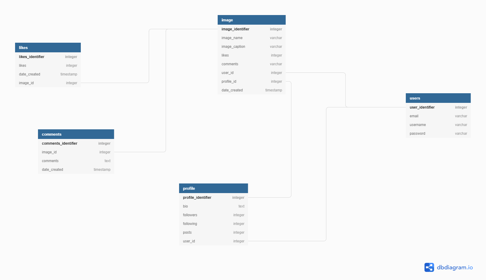

# Title

* Awwards


## Description
Awward is a website that allows people to present their websites to be critiqued by other developers and users.


## Technologies used
    - Python 3.6
    - HTML
    - Bootstrap 4
    - Heroku
    - Postgresql
    - Django


## Setup and installations
### Prerequisites
1. [Python3.6](https://www.python.org/downloads/)
2. [virtualenv](https://virtualenv.pypa.io/en/stable/installation/)
3. [Pip](https://pip.pypa.io/en/stable/installing/)

### Clone the Repo and rename it to suit your needs.
```bash
git clone https://github.com/antomuli/Awwards.git
```
### Initialize git and add the remote repository
```bash
git init
```
```bash
git remote add origin <your-repository-url>
```
### Create and activate the virtual environment
```bash
python3.6 -m virtualenv virtual
```
```bash
source virtual/bin/activate
```
### Setting up environment variables
Create a `.env` file and paste paste the following filling where appropriate:
```
SECRET_KEY='<YOUR_SECRET_KEY_HERE>
DEBUG=True #set to false in production
DB_NAME=<YOUR_DATA_BASE_NAME>
DB_USER=<YOUR_DATA_BASE_USER>
DB_PASSWORD=<YOUR_DATA_BASE_PASSWORD>
DB_HOST='127.0.0.1'
MODE='dev' #set to 'prod' in production
ALLOWED_HOSTS='.localhost', '.herokuapp.com', '.127.0.0.1'
DISABLE_COLLECTSTATIC=1
```


### Database Design




### Install dependancies
Install dependancies that will create an environment for the app to run

```bash
pip install -r requirements.txt
```
#### Run migrations
```bash
python manage.py migrate
```
#### Run the app
```bash
python manage.py runserver
```
#### Access the application through localhost:8000
Open [localhost:8000](http://127.0.0.1:8000/)

### Contributing

Please read this [comprehensive guide](https://opensource.guide/how-to-contribute/) on how to contribute. Pull requests are welcome :-)

### Bugs
Create an issue mentioning the bug you have found

### Known bugs

- N/A

### Support and contact details

Contact [Anthony Muli](mulianthony561@gmail.com) for further help/support

### License

[MIT](/License)

Copyright (c)2020 **Anthony Muli**